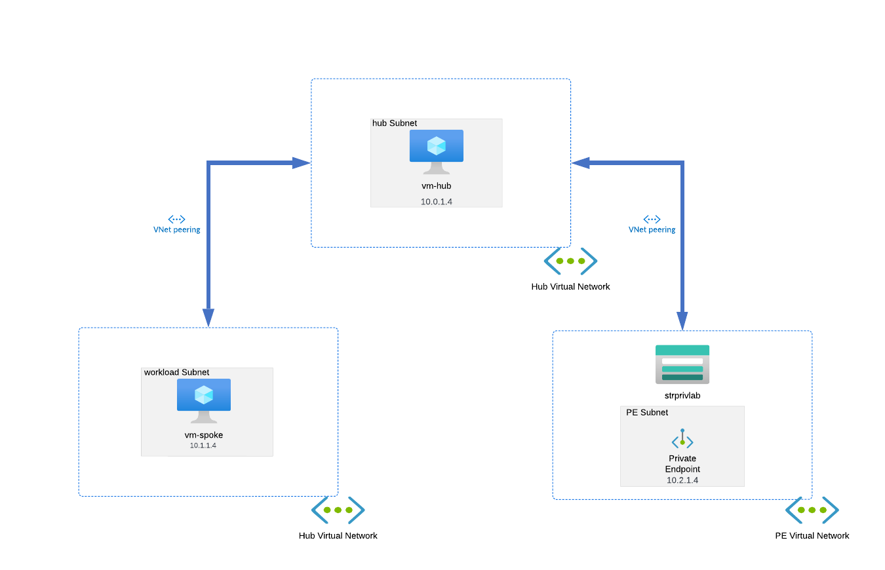
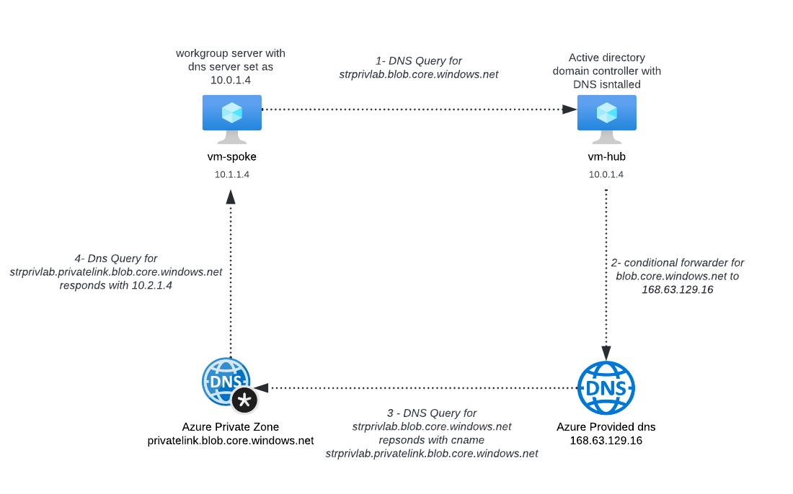

## **Private endpoint and DNS demo**
#### Overview
 <font size="2">
In this example we will be deploying a small demo environment to demonstrate how DNS resolution works for private endpoints including creating a private dns zone and setting up a conditional forwarder on a windows dns server so it can serve lookups for private endpoint dns records. It also includes a test workstation set to use the domain controller for DNS. The domain controller will have a conditional forwarder for the blob.core.windows.net dns name to 168.63.129.16 so it can resolve the private endpoint dns record in the private dns zone created.  We will also demostrate connecting to a storage account over the private endpoint to download a file

##### The solution
Here is a network diagram of the solution deployed by the code



##### How dns resolution works 
This is a diagram depicting how dns resolution works when using azure private dns zones. A common design pattern is to then point your on premise domain controller at the Azure domain controller to use as a DNS forwarder to allow private endpoint resolution as you cannot use 168.63.129.16 outside of Azure.





**Code Structure**

```
├─ .gitignore
├─ images
│  ├─ solution.png
│  └─ withcustom.PNG
├─ README.md
├─ scripts
│  ├─ create_1st_dom.ps1
│  ├─ storage_account_file_download.ps1
│  └─ storage_account_testing.ps1
└─ terraform
   ├─ 01_network_dns.tf
   ├─ 02_storage_acc_pe.tf
   ├─ 03_dc.tf
   ├─ 03_test_vm.tf
   ├─ backend.tf
   ├─ datasource.tf
   ├─ locals.tf
   ├─ main.tf
   ├─ outputs.tf
   ├─ providers.tf
   ├─ testfile.txt
   ├─ variables.tf
   └─ versions.tf

```

**Deployment Guide**
**Prerequisites:**

- An account and relevant access permissions to a subscription
- Azure cli installed [here](https://learn.microsoft.com/en-us/cli/azure/install-azure-cli)
- Terraform installed [here](https://learn.hashicorp.com/tutorials/terraform/install-cli)

**Deployment steps:**
- Firstly if you want to use you own custom domain name add it via Azure AD using the guide [here](https://learn.microsoft.com/en-us/azure/active-directory/fundamentals/add-custom-domain) then change the custom_domain_name variable to your custom domain and set the enable_custom_domain variable to true. Then create a cname record for hostname strprivlab..*custom_domain* to strprivlab.blob.core.windows.net like the guide [here](https://learn.microsoft.com/en-us/azure/storage/blobs/storage-custom-domain-name?tabs=azure-portal#register-a-custom-domain)
- Clone this repo and change to the terraform directory then run a terraform apply i.e "terraform apply -var="management_ip=88.88.88.88" -var="dsrm_password=superpassword5", you provide the management ip and dsrm password variable. The management ip will be your source ip when you connect to VM and will be allowed via NSG. Storage account names must be unique so you may need to update the storage_account_name variable value.
- once deployed use terraform output "terraform output -json" to display the terraform outputs including those which are set to sensitive
- Remote desktop to the test work station using the output value for "spoke_pip" and login using adminuser as the username and the password from the "vm_pwd_spoke" output.
- firstly open powershell and run "nslookup strprivlab.blob.core.windows.net" this should return  (if you have a custom domain use strprivlab.*custom_domain* to allow dns lookups based on your custom domain name add a cname record for strprivlab.*custom_domain* to strprivlab.blob.core.windows.net)
- Remote desktop to the domain controller using the output value for "dc_pip" and login using azure-labs\adminuser as the username and the password from the "vm_pwd_dc" output.
- now copy and run the below script onto the machine and paste in a powershell window, update the "Sas" variable with the "sas_url_query_string" terraform output
```
$Storage_Account = "strprivlab"
$Storage_Container = "content"
$Storage_file = "testfile.txt"
$Output_Path = ".\"
$Sas = ""
$Sas = $Sas.replace("\u0026","&") # replacing json encoding for ambersand character


$Blob_Uri = "https://$Storage_Account.blob.core.windows.net/$Storage_Container/$Storage_file"
$Output_Path = ".\$Storage_file"

$Full_Uri = "$Blob_Uri$Sas"
(New-Object System.Net.WebClient).DownloadFile($Full_Uri, $Output_Path)

```
the file should now be downloaded onto the machine


